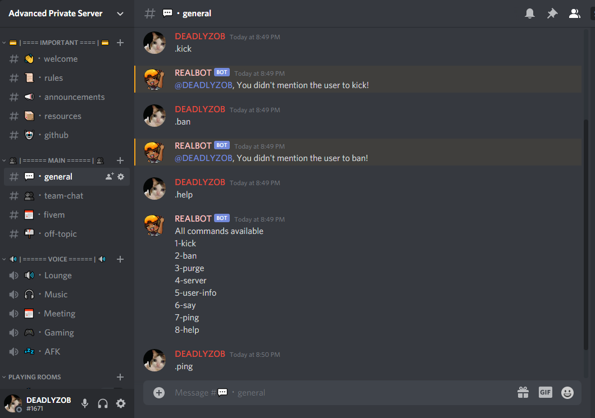
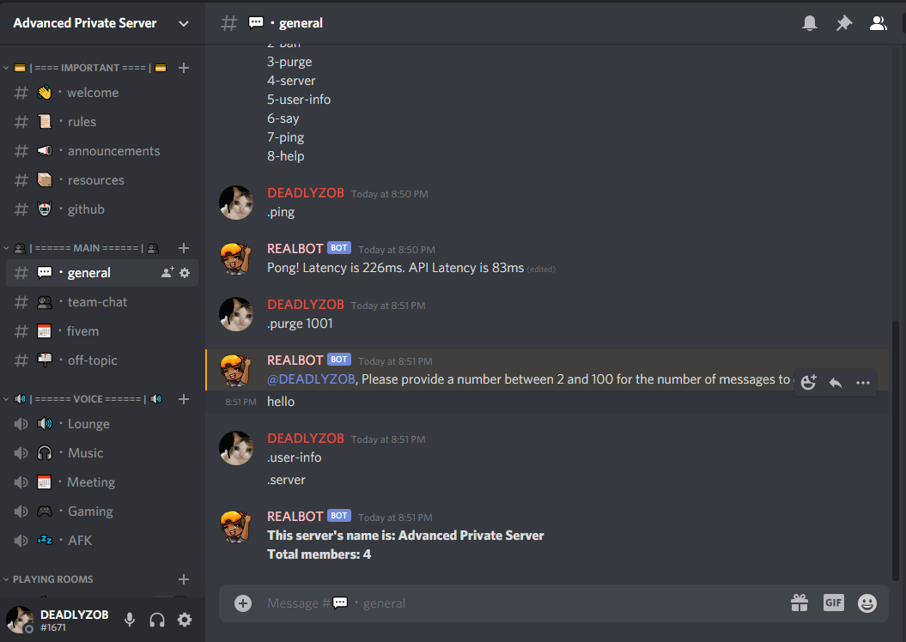

# Discord Bot

Simple discord bot built with dicord.js

## Getting Started

Simple Discord Bot . For your Discord server A simple moderation Bot . 
commands:- purge,kick,ban,say,user-info,server,help,ping 

### Installing

You need to install node.js and then you need install some assets open command prompt and type npm install discord.js . you need install this in your main folder. Paste your bot token in config.json

## Built With

* [NODE.JS](https://nodejs.org/en/)
* [DISCORD.JS](https://discord.js.org/#/)

## Screenshots

License
-------

Refer to the [LICENSE](LICENSE) file.
